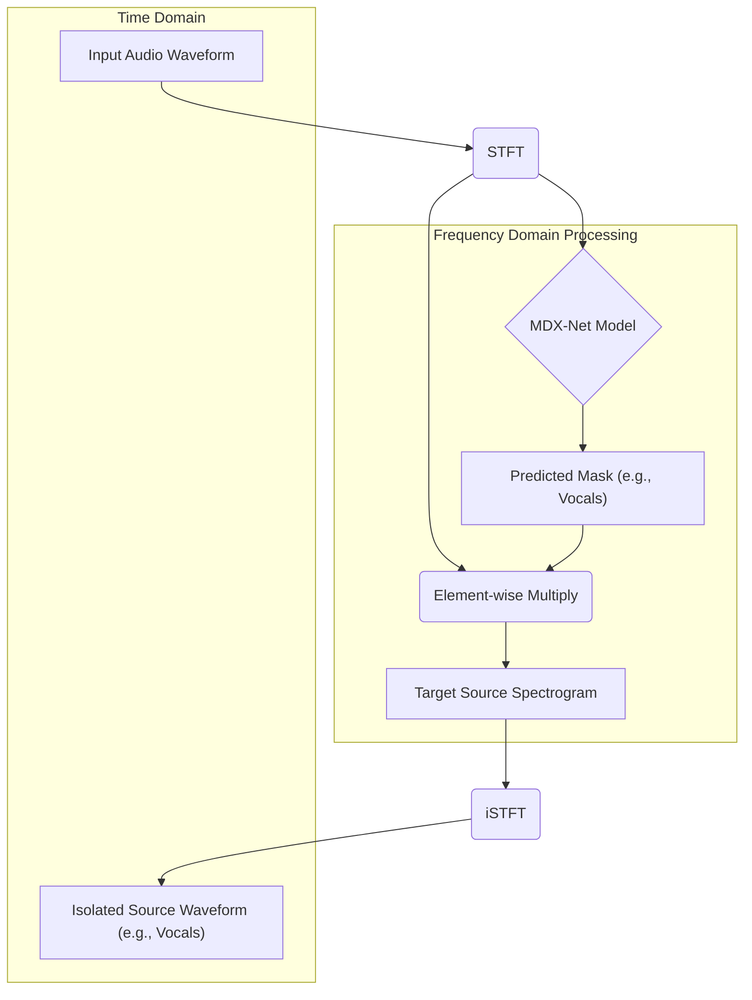
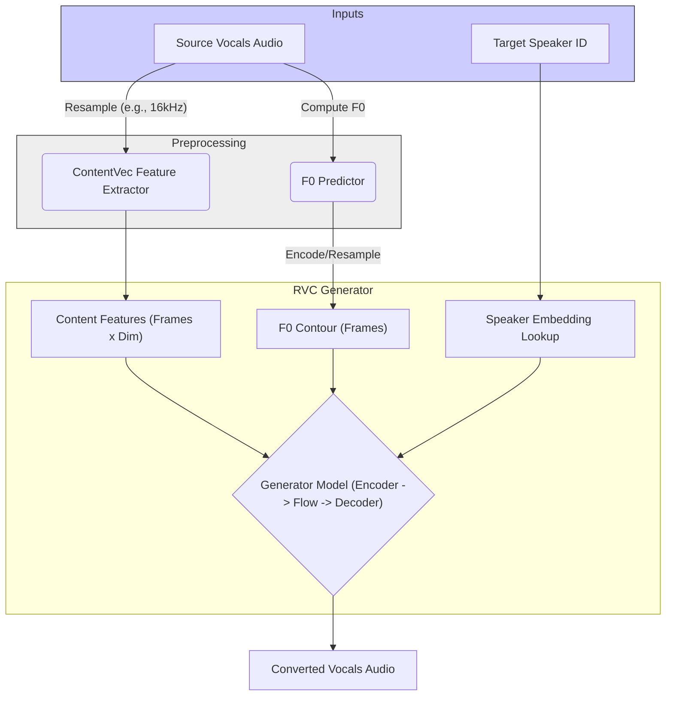
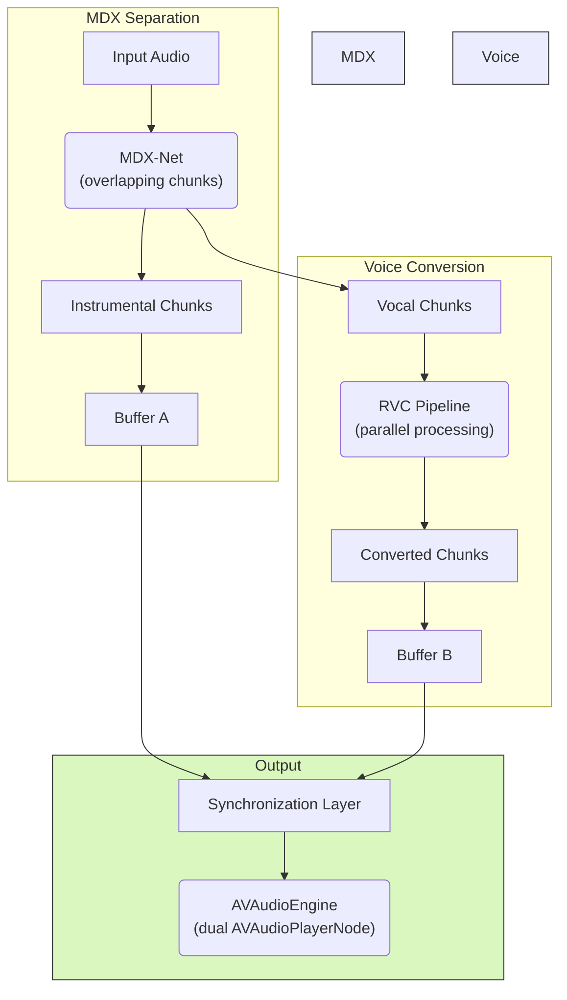

--
date: 2025-10-26 19:07
description: Using MDX-Net and Retrieval Based Voice Conversion (RVC) in Swift via ONNX and CoreML (+ Accelerate and AVFoundation)
tags: ONNX, CoreML, Swift, macOS, RVC, Audio Processing
draft: false
--

# Swift Sings: MDX-Net Vocal Splits and RVC Voice Conversion On-Device with ONNX/CoreML

As silly as the idea of making any song sound like it was sung by T-Swizzle sounds, it is a fascinating problem\! With the amazing work done by the people behind [Ultimate Vocal Remover](https://github.com/Anjok07/ultimatevocalremovergui) and [Retrieval-based Voice Conversion (RVC)](https://github.com/RVC-Project/Retrieval-based-Voice-Conversion), it has become very accessible.

I wanted to be able to run the entire pipeline automagically through a SwiftUI program (my obsession with re-writing everything in pure Swift is still going strong) without any external dependencies like `librosa`, the WORLD Vocoder, or `Praat`. I did think that using ONNX itself was a cop out too, so I ended up converting the models to CoreML and thus the final result does not depend on anything other than Apple provided frameworks like `AVFoundation` and `Accelerate`.

In my opinion, this is one of the more fun things I’ve done for the love of the game recently—the game being doing silly things in Swift/macOS just because I can. Womp womp if you don’t find it as interesting or fun as I did. Here’s a recording of T-Swizzle “singing” *Stick Season* by Noah Kahan with an episode of *Supernatural* playing in the background that I sent to my friends:


<iframe height="560" width="315" src="https://www.youtube.com/embed/5VXrDbyU0kg" title="YouTube video player" frameborder="0" allow="accelerometer; autoplay; clipboard-write; encrypted-media; gyroscope; picture-in-picture" allowfullscreen></iframe>

(All three CoreML models were quantized to Int8)

## Understanding the Pipeline

Before diving into platform-specific implementations, we need to understand these machine learning models powering this voice conversion pipeline.

### Step 1: Splitting the Track (MDX-Net)

The first step is source separation: isolating the vocals from the instrumental track in the input song. For this, we use an MDX-Net model, specifically a variant trained to separate vocals and instruments.

These models operate primarily in the frequency domain. The input audio waveform is transformed into a complex-valued spectrogram using the Short-Time Fourier Transform (STFT). This transformation breaks the signal into short, overlapping frames, applies a window function to each frame, and then computes the Discrete Fourier Transform (DFT) for each windowed frame. Mathematically, the STFT $X$ of a signal $x[n]$ is often represented as:

$$X[m, k] = \sum_{n=0}^{N-1} x[n + mH] w[n] e^{-j \frac{2\pi nk}{N}}$$

where $x[n]$ is the input signal, $w[n]$ is the window function of length $N$, $H$ is the hop size (number of samples between frames), $m$ is the frame index, and $k$ is the frequency bin index. The result $X[m, k]$ is a complex number representing the magnitude and phase for frequency bin $k$ at frame $m$.

This spectrogram captures how the frequency content changes over time. The MDX-Net model processes this representation (often its magnitude component) and predicts a mask, typically with values between 0 and 1. This mask represents the likelihood that each time-frequency bin belongs to the target source (e.g., vocals).

Multiplying the input spectrogram's magnitude by the predicted mask yields the magnitude of the target source's spectrogram. The phase from the original input spectrogram is usually reused. Finally, the inverse STFT (iSTFT) transforms this reconstructed complex spectrogram back into the time-domain audio waveform. The iSTFT essentially reverses the process by performing an inverse DFT on each frame and then combining the overlapping frames using an overlap-add method, often weighted by the window function to ensure perfect reconstruction under certain conditions (like using a Hann window with 50% overlap). A simplified representation considering normalization for perfect reconstruction is:

$$x_{rec}[n] = \frac{\sum_{m=-\infty}^{\infty} w[n-mH] \left( \frac{1}{N} \sum_{k=0}^{N-1} X[m, k] e^{j \frac{2\pi nk}{N}} \right)}{\sum_{m=-\infty}^{\infty} w^2[n-mH]}$$

where $X[m, k]$ is the (potentially modified) spectrogram, and $w[n]$ is the analysis window. The denominator handles the normalization required due to the overlapping windows.

The specific model used here (`mdx23c_instvoc_hq2`) utilizes a U-Net-like structure. This involves convolutional layers that progressively downsample the input spectrogram, followed by upsampling layers with skip connections to reconstruct the output mask. Modules like Time-Frequency Convolutions (TFC), Temporal Dilated Convolutions (TDC), and potentially Atrous Spatial Pyramid Pooling (ASPP) are often integrated. Although, this is not the best performing model these days, this was one of the few models with its original PyTorch checkpoints available which is needed to convert to CoreML.



#### Separation Logic

```python
def separate_vocals_instruments(audio_waveform, mdx_model):
  # Convert audio to complex spectrogram
  input_spectrogram = stft(audio_waveform, n_fft=N, hop_length=H, window=W)
  input_magnitude = abs(input_spectrogram)
  input_phase = angle(input_spectrogram)

  # Prepare input for the model (e.g., reshape, normalize)
  model_input = prepare_model_input(input_magnitude) # Shape [Batch, Channels, FreqBins, TimeFrames]

  # Predict the mask (assuming model outputs vocal mask)
  vocal_mask = mdx_model.predict(model_input) # Values typically [0, 1]

  # Apply masks to get source magnitudes
  vocal_magnitude = input_magnitude * vocal_mask
  instrumental_magnitude = input_magnitude * (1 - vocal_mask) # Complementary mask

  # Reconstruct complex spectrograms using original phase
  vocal_spectrogram = vocal_magnitude * exp(1j * input_phase)
  instrumental_spectrogram = instrumental_magnitude * exp(1j * input_phase)

  # Convert back to audio waveform
  vocal_waveform = istft(vocal_spectrogram, hop_length=H, window=W)
  instrumental_waveform = istft(instrumental_spectrogram, hop_length=H, window=W)

  return vocal_waveform, instrumental_waveform
```

### Step 2: Changing the Voice (RVC)

With the vocals isolated, the next step is voice conversion. RVC modifies the vocal timbre while preserving content and melody, using pre-trained models.

RVC takes the isolated vocal audio. It extracts content features using ContentVec/HuBERT and estimates the fundamental frequency (F0) contour. These, plus a target speaker ID, go into a generator model that synthesizes audio in the target voice.

1.  Content Feature Extractor: ContentVec or HuBERT, providing speaker-invariant linguistic features.
2.  F0 Predictor: Estimates the pitch contour. Common algorithms include DIO, Harvest, RMVPE, Crepe. The **DIO** (Distributed Inline Optimization) algorithm which I ended up implementing, estimates F0 by finding the time lag $\tau$ that maximizes a normalized autocorrelation function within a plausible range. For a signal frame $x(t)$, this conceptually involves finding:

$$\tau_{best} = \arg \max_{\tau_{min} \le \tau \le \tau_{max}} \frac{\sum_{t=0}^{L-\tau-1} x(t) x(t+\tau)}{\sqrt{\sum_{t=0}^{L-\tau-1} x^2(t) \sum_{t=0}^{L-\tau-1} x^2(t+\tau)}}$$

where $L$ is the frame length, and $\tau_{min}, \tau_{max}$ correspond to the period limits (inverse of $f_{max}, f_{min}$). The fundamental frequency is then $F0 = \text{sample\_rate} / \tau_{best}$. Refinements like Stonemask improve robustness.

3.  Generator: A VITS-like architecture:
      * An **Encoder** processes content features and pitch.
      * A **Speaker Embedding** conditions on the target voice.
      * A **Flow-based module** transforms features probabilistically.
      * A **Decoder** synthesizes the waveform.




```python
def voice_conversion(vocal_audio, target_sid, rvc_generator, contentvec_model, f0_predictor, f0_up_key=0, index=None, index_rate=0.75):
  # 1. Extract Content Features
  audio_16k = resample(vocal_audio, target_sr=16000)
  content_features = contentvec_model.extract(audio_16k) # Shape [Batch, Frames, FeatureDim]
  content_features = adjust_feature_rate(content_features, target_frame_rate=rvc_frame_rate) # Shape [Batch, RVC_Frames, FeatureDim]

  # 2. Extract and Process Pitch (F0)
  f0_contour = f0_predictor.compute(vocal_audio, frame_rate=rvc_frame_rate) # Shape [RVC_Frames]
  f0_contour = f0_contour * (2**(f0_up_key / 12.0)) # Pitch Shift
  pitch_encoded = encode_f0_to_bins(f0_contour) # Shape [Batch, RVC_Frames]
  pitch_float = f0_contour.reshape(1, -1) # Shape [Batch, RVC_Frames]

  # Ensure lengths match
  target_len = min(content_features.shape[1], pitch_encoded.shape[1])
  # (Trim features and pitch arrays to target_len)
  frame_lengths = torch.tensor([target_len], dtype=torch.long)

  # 3. Optional: Feature Retrieval
  if index is not None and index_rate < 1.0:
      # (Search index, compute weighted average, blend features)
      pass # Simplified for brevity

  # 4. Synthesize Audio
  noise_input = torch.randn(1, NoiseDim, target_len).to(content_features.device)
  speaker_id_tensor = torch.tensor([target_sid], dtype=torch.long).to(content_features.device)

  output_audio = rvc_generator.infer(
      phone=content_features, phone_lengths=frame_lengths,
      pitch=pitch_encoded, pitchf=pitch_float,
      sid=speaker_id_tensor, rnd=noise_input
  ) # Shape [Batch, Channels, Samples]

  return output_audio.squeeze()
```

## Exporting to ONNX (The Easy Part)

Everybody loves ONNX! This is probably the easiest way to export models so they can run on multiple platforms through the ONNX runtime.

### Conversion

The standard process uses `torch.onnx.export`, tracing the model with dummy inputs and defining dynamic axes for variable dimensions (like time).

#### MDX-Net to ONNX

For MDX-Net vocal separation models, the export is straightforward since the model architecture is relatively simple compared to RVC:

```python
import torch
from mdx23c_model import TFC_TDF_Net, load_config

# Load the MDX23C model
model = TFC_TDF_Net(config)
checkpoint = torch.load("mdx23c_checkpoint.ckpt", map_location="cpu")
model.load_state_dict(checkpoint["state_dict"])
model.eval()

# Create dummy input: [batch, stereo_channels*2, freq_bins, time_frames]
# The model expects interleaved real/imag parts for stereo input
dummy_spec = torch.randn(1, 4, 1024, 256)

# Export to ONNX with dynamic time dimension
torch.onnx.export(
    model,
    dummy_spec,
    "mdx23c_vocals.onnx",
    input_names=["spec"],
    output_names=["mask"],
    dynamic_axes={
        "spec": {3: "time"},     # Time dimension can vary
        "mask": {3: "time"}
    },
    opset_version=17,
    do_constant_folding=True
)
```

The time dimension is marked as dynamic so the model can process audio of any length. The frequency dimension (1024 bins) is fixed based on the STFT configuration.

#### RVC to ONNX

RVC model export is more involved due to multiple inputs and the complex VITS-based architecture. The full implementation recreates the model architecture from scratch to avoid dependencies:

```python
# From model2onnx.py
def export_onnx(checkpoint_path, output_path, opset=18, device="cpu"):
    # Load RVC checkpoint (contains weights and config)
    checkpoint = torch.load(checkpoint_path, map_location="cpu")
    if "weight" not in checkpoint or "config" not in checkpoint:
        raise ValueError(f"{checkpoint_path} is not a valid RVC checkpoint.")

    # Build model from config
    cfg = list(checkpoint["config"])
    emb_dim = checkpoint["weight"]["emb_g.weight"].shape[0]
    cfg[-3] = emb_dim  # Update speaker embedding dimension

    model = SynthesizerTrnMsNSFsidM(
        *cfg,
        version=checkpoint.get("version", "v1"),  # v1 uses 256-dim, v2 uses 768-dim ContentVec
        is_half=False  # Always export as float32
    )
    model.load_state_dict(checkpoint["weight"], strict=False)
    model.eval()

    # Determine ContentVec dimension based on version
    vec_channels = 256 if checkpoint.get("version", "v1") == "v1" else 768

    # Create dummy inputs
    test_len = 200  # Frame count
    phone = torch.rand(1, test_len, vec_channels)           # ContentVec features
    phone_lengths = torch.tensor([test_len], dtype=torch.int64)
    pitch = torch.randint(5, 255, (1, test_len), dtype=torch.int64)  # Mel-scale F0 bins
    pitchf = torch.rand(1, test_len)                        # Floating-point F0 values
    ds = torch.zeros(1, dtype=torch.int64)                  # Speaker ID (deprecated, use 0)
    rnd = torch.rand(1, 192, test_len)                      # Noise input for stochastic generation

    # Export with all dynamic axes
    torch.onnx.export(
        model,
        (phone, phone_lengths, pitch, pitchf, ds, rnd),
        output_path,
        input_names=["phone", "phone_lengths", "pitch", "pitchf", "ds", "rnd"],
        output_names=["audio"],
        opset_version=opset,
        dynamic_axes={
            "phone": {1: "frames"},          # Time dimension
            "pitch": {1: "frames"},
            "pitchf": {1: "frames"},
            "rnd": {2: "frames"},
            "audio": {2: "audio_frames"}     # Output audio length
        },
        do_constant_folding=False,  # Preserve model structure
    )

# Usage
export_onnx("TSModel/model.pth", "tswift.onnx")
```

`phone_lengths` determines the actual sequence length during inference, allowing the model to handle variable-length inputs despite fixed tensor shapes. The output audio length is roughly `frames * hop_size` samples.

### Inference with ONNX Runtime (Swift)

ONNX Runtime provides cross-platform ML inference with support for multiple execution providers (CPU, CoreML, CUDA, etc.). The Swift bindings require careful memory management since we're bridging to C++ libraries.

#### Setup and Session Creation

```swift
import OnnxRuntimeBindings
import Accelerate

// 1. Initialize ONNX Runtime Environment
let env = try ORTEnv(loggingLevel: .warning)

// 2. Configure Session Options
let sessionOptions = try ORTSessionOptions()

// Optimize for CPU performance
let cpuThreads = max(1, ProcessInfo.processInfo.processorCount - 1)
try sessionOptions.setIntraOpNumThreads(Int32(cpuThreads))
try sessionOptions.setGraphOptimizationLevel(.all)

// Optional: Use CoreML execution provider on Apple platforms
// try sessionOptions.appendCoreMLExecutionProvider()
// I have personally never been able to get better performance using this with ONNX
// But, I am also a silly goose

// 3. Load Model Sessions
let generatorSession = try ORTSession(
    env: env,
    modelPath: "tswift.onnx",
    sessionOptions: sessionOptions
)

let vectorSession = try ORTSession(
    env: env,
    modelPath: "vec-768-layer-12.onnx",
    sessionOptions: sessionOptions
)
```

#### Complete Inference Pipeline

The inference process involves multiple stages: extracting ContentVec features, computing F0, and running the generator:

```swift
func performRVCInference(
    audio: [Float],
    sampleRate: Double,
    f0UpKey: Int,
    sid: Int64 = 0
) throws -> [Float] {
    // ===== Stage 1: Extract ContentVec Features =====

    // Resample to 16kHz for ContentVec
    let audio16k = resample(audio, from: sampleRate, to: 16000.0)

    // Create input tensor for ContentVec [1, samples]
    let contentVecInput = try ORTValue(
        tensorData: NSMutableData(
            data: Data(bytes: audio16k, count: audio16k.count * MemoryLayout<Float>.stride)
        ),
        elementType: .float,
        shape: [1, NSNumber(value: audio16k.count)]
    )

    // Run ContentVec extraction
    let vectorOutputs = try vectorSession.run(
        withInputs: ["source": contentVecInput],
        outputNames: Set(["output"]),
        runOptions: nil
    )

    // Extract features [1, frames, 768]
    guard let featuresValue = vectorOutputs["output"] else {
        throw RVCError.missingOutput("ContentVec output")
    }
    let featuresData = try featuresValue.tensorData() as Data
    let featureArray: [Float] = featuresData.withUnsafeBytes {
        Array(UnsafeBufferPointer(
            start: $0.baseAddress!.assumingMemoryBound(to: Float.self),
            count: featuresData.count / MemoryLayout<Float>.stride
        ))
    }

    // Determine frame count (frames = array length / 768)
    let frameCount = featureArray.count / 768

    // ===== Stage 2: Compute F0 (Pitch) =====

    // Use DIO algorithm to extract fundamental frequency
    let f0Contour = computeDIOF0(
        audio: audio,
        sampleRate: sampleRate,
        hopLength: 64,
        frameCount: frameCount
    )

    // Apply pitch shift
    let pitchShiftMultiplier = powf(2.0, Float(f0UpKey) / 12.0)
    let f0Shifted = f0Contour.map { $0 * pitchShiftMultiplier }

    // Convert to mel-scale bins [1..255, or 0 for unvoiced]
    let f0MelMin: Float = 1127.0 * log(1.0 + 50.0 / 700.0)
    let f0MelMax: Float = 1127.0 * log(1.0 + 1100.0 / 700.0)
    let melScale: Float = 254.0 / (f0MelMax - f0MelMin)

    let f0Bins: [Int64] = f0Shifted.map { f0 in
        guard f0 > 1.0 else { return 0 }
        let mel = 1127.0 * log(1.0 + f0 / 700.0)
        let normalized = ((mel - f0MelMin) / (f0MelMax - f0MelMin)) * 254.0
        return Int64(max(1, min(255, normalized + 1)))
    }

    // ===== Stage 3: Prepare Generator Inputs =====

    // phone: ContentVec features [1, frames, 768]
    let phoneTensor = try ORTValue(
        tensorData: NSMutableData(data: Data(bytes: featureArray,
                                             count: featureArray.count * MemoryLayout<Float>.stride)),
        elementType: .float,
        shape: [1, NSNumber(value: frameCount), 768]
    )

    // phone_lengths: actual sequence length [1]
    let lengthTensor = try ORTValue(
        tensorData: NSMutableData(data: Data(bytes: [Int64(frameCount)],
                                             count: MemoryLayout<Int64>.stride)),
        elementType: .int64,
        shape: [1]
    )

    // pitch: mel-scale F0 bins [1, frames]
    let pitchTensor = try ORTValue(
        tensorData: NSMutableData(data: Data(bytes: f0Bins,
                                             count: f0Bins.count * MemoryLayout<Int64>.stride)),
        elementType: .int64,
        shape: [1, NSNumber(value: frameCount)]
    )

    // pitchf: floating-point F0 contour [1, frames]
    let pitchfTensor = try ORTValue(
        tensorData: NSMutableData(data: Data(bytes: f0Shifted,
                                             count: f0Shifted.count * MemoryLayout<Float>.stride)),
        elementType: .float,
        shape: [1, NSNumber(value: frameCount)]
    )

    // ds/sid: speaker ID (use 0 for single-speaker models) [1]
    let sidTensor = try ORTValue(
        tensorData: NSMutableData(data: Data(bytes: [sid],
                                             count: MemoryLayout<Int64>.stride)),
        elementType: .int64,
        shape: [1]
    )

    // rnd: random noise for stochastic generation [1, 192, frames]
    var randomNoise = [Float](repeating: 0, count: 192 * frameCount)
    for i in 0..<randomNoise.count {
        randomNoise[i] = Float.random(in: -1...1)
    }
    let noiseTensor = try ORTValue(
        tensorData: NSMutableData(data: Data(bytes: randomNoise,
                                             count: randomNoise.count * MemoryLayout<Float>.stride)),
        elementType: .float,
        shape: [1, 192, NSNumber(value: frameCount)]
    )

    // ===== Stage 4: Run RVC Generator =====

    let generatorOutputs = try generatorSession.run(
        withInputs: [
            "phone": phoneTensor,
            "phone_lengths": lengthTensor,
            "pitch": pitchTensor,
            "pitchf": pitchfTensor,
            "ds": sidTensor,
            "rnd": noiseTensor
        ],
        outputNames: Set(["audio"]),
        runOptions: nil
    )

    // ===== Stage 5: Extract Output Audio =====

    guard let audioTensor = generatorOutputs["audio"] else {
        throw RVCError.missingOutput("audio")
    }

    let audioData = try audioTensor.tensorData() as Data
    let outputAudio: [Float] = audioData.withUnsafeBytes {
        Array(UnsafeBufferPointer(
            start: $0.baseAddress!.assumingMemoryBound(to: Float.self),
            count: audioData.count / MemoryLayout<Float>.stride
        ))
    }

    return outputAudio
}
```

The key challenge is managing all the tensor shapes and ensuring the memory layout matches ONNX's expectations. Notice how we use `NSMutableData` to bridge Swift arrays to the C++ ONNX Runtime—this is necessary because `ORTValue` requires pointer-backed storage.

-----

## Exporting to CoreML (The Not So Easy Part)

CoreML allows leveraging Apple hardware (GPU, Neural Engine). Using `coremltools` is the standard way to create CoreML models.

### Conversion

CoreML conversion follows a general pattern: trace the PyTorch model, then convert using `coremltools` with flexible input shapes. The key is defining `RangeDim` for variable-length dimensions:

```python
import coremltools as ct
import torch

# General pattern for CoreML conversion
traced_model = torch.jit.trace(model, example_inputs, strict=False)
traced_model.eval()

# Define flexible shapes using RangeDim
range_dim = ct.RangeDim(lower_bound=32, upper_bound=4096)

mlmodel = ct.convert(
    traced_model,
    convert_to="mlprogram",
    minimum_deployment_target=ct.target.iOS17,
    compute_units=ct.ComputeUnit.ALL,  # CPU + GPU + Neural Engine
    inputs=[
        ct.TensorType(
            name="input",
            shape=(1, range_dim, 768),
            dtype=np.float32
        )
    ],
)

mlmodel.save("model.mlpackage")
```

The `mlprogram` format (introduced in iOS 15) is more flexible than the legacy `neuralnetwork` format and supports dynamic shapes natively.

#### Patching `coremltools`

During RVC conversion, I encountered an issue with the `slice` operator. The RVC generator uses dynamic slicing to trim output to the correct length:

```python
# In the RVC generator forward pass
z = self.flow(z_p, x_mask, g=g, reverse=True)
max_len = max_len if max_len is not None else z.shape[2]
o = self.dec((z * x_mask)[:, :, :max_len], nsff0, g=g)  # Slice to max_len
```

The problem is that `max_len` is computed from `phone_lengths` and is therefore **symbolic**—it varies per input. The coremltools slice converter (as of version 8.3) doesn't properly handle this case and tries to evaluate the symbolic value as a constant, causing conversion to fail.

**The Issue:**

```python
# In coremltools/converters/mil/frontend/torch/ops.py (simplified)
@register_torch_op
def slice(context, node):
    # ...
    end = end_val.val  # Crashes if end_val is symbolic (None) :(((( kms
    # ...
```

**The Workaround:**

I patched the converter to detect symbolic slice indices and use the input tensor's shape dimension instead:

```python
# Patched slice converter
@register_torch_op
def slice(context, node):
    inputs = _get_inputs(context, node)
    input_tensor = inputs[0]
    axis = inputs[1].val
    start = inputs[2].val if inputs[2].val is not None else 0
    end = inputs[3]

    # Handle symbolic end index
    if end.val is None:
        # Use the full dimension size from input shape
        input_shape = input_tensor.shape
        end_value = input_shape[axis]
    else:
        end_value = end.val

    # ... rest of slice logic
```

This allows CoreML to infer the correct slice bounds at runtime based on the actual input shape. An alternative approach is to ensure the model is traced with realistic variable-length inputs so torch.jit captures the dynamic behavior correctly.

#### MDX-Net to CoreML

MDX-Net conversion is straightforward but requires embedding audio processing parameters in the model metadata:

```python
# From convert_mdx23c_coreml.py
import coremltools as ct
import yaml

def export_mdx_coreml(checkpoint_path, config_path, output_path):
    # Load configuration
    with open(config_path) as f:
        cfg_dict = yaml.safe_load(f)
    cfg = load_config(cfg_dict)

    # Load model
    model = TFC_TDF_Net(cfg)
    state_dict = torch.load(checkpoint_path)["state_dict"]
    # Filter out STFT weights (recomputed at runtime)
    filtered = {k: v for k, v in state_dict.items() if not k.startswith("stft")}
    model.load_state_dict(filtered, strict=False)
    model.eval()

    # Trace with fixed frequency bins, flexible time
    dummy = torch.zeros(1, cfg.audio.num_channels * 2,
                       cfg.audio.dim_f,
                       cfg_dict["inference"]["dim_t"])
    traced = torch.jit.trace(model, dummy, strict=False)

    # Convert to CoreML
    mlmodel = ct.convert(
        traced,
        convert_to="mlprogram",
        minimum_deployment_target=ct.target.iOS17,
        inputs=[ct.TensorType(name="spec", shape=dummy.shape, dtype=np.float32)]
    )

    # Embed audio parameters for runtime STFT/iSTFT
    mlmodel.user_defined_metadata["n_fft"] = str(cfg_dict["audio"]["n_fft"])
    mlmodel.user_defined_metadata["hop_length"] = str(cfg_dict["audio"]["hop_length"])
    mlmodel.user_defined_metadata["dim_f"] = str(cfg.audio.dim_f)

    mlmodel.save(str(output_path))
```

The metadata is crucial because the Swift implementation reads these values to configure its STFT/iSTFT parameters to match what the model expects.

#### ContentVec to CoreML

ContentVec is based on Fairseq's HuBERT, but we need to remap the state dict to match `torchaudio`'s implementation. This is the trickiest conversion:

```python
# From contentvec2coreml.py
import torchaudio
import sys
import types

# Stub out fairseq for unpickling the checkpoint
def _stub_fairseq():
    if "fairseq" in sys.modules:
        return
    fairseq = types.ModuleType("fairseq")
    fairseq_data = types.ModuleType("fairseq.data")
    dictionary = types.ModuleType("fairseq.data.dictionary")

    class Dictionary:
        pass

    dictionary.Dictionary = Dictionary
    fairseq.data = fairseq_data
    fairseq_data.dictionary = dictionary

    sys.modules["fairseq"] = fairseq
    sys.modules["fairseq.data"] = fairseq_data
    sys.modules["fairseq.data.dictionary"] = dictionary

def export_contentvec_coreml(checkpoint_path, output_path):
    _stub_fairseq()

    # Load Fairseq checkpoint
    checkpoint = torch.load(checkpoint_path, map_location="cpu", weights_only=False)
    state_dict = checkpoint["model"]

    # Remap keys from Fairseq to torchaudio HuBERT
    remapped = {}
    for key, tensor in state_dict.items():
        # Encoder layers: "encoder.layers.N" -> "encoder.transformer.layers.N"
        if key.startswith("encoder.layers."):
            parts = key.split(".")
            layer_idx = int(parts[2])
            if layer_idx >= 12:  # Drop extra layers beyond 12
                continue
            new_key = key.replace("encoder.layers.", "encoder.transformer.layers.")
            new_key = new_key.replace("self_attn.", "attention.")
            new_key = new_key.replace("self_attn_layer_norm", "layer_norm")
            new_key = new_key.replace("fc1", "feed_forward.intermediate_dense")
            new_key = new_key.replace("fc2", "feed_forward.output_dense")
            remapped[new_key] = tensor

        # Positional conv with weight_norm
        elif key.startswith("encoder.pos_conv.0."):
            if key.endswith("weight_g"):
                remapped["encoder.transformer.pos_conv_embed.conv.parametrizations.weight.original0"] = tensor
            elif key.endswith("weight_v"):
                remapped["encoder.transformer.pos_conv_embed.conv.parametrizations.weight.original1"] = tensor
            elif key.endswith("bias"):
                remapped["encoder.transformer.pos_conv_embed.conv.bias"] = tensor

        # Post-extract projection
        elif key.startswith("post_extract_proj"):
            remapped[key.replace("post_extract_proj", "encoder.feature_projection.projection")] = tensor

        # Layer norm
        elif key.startswith("encoder.layer_norm"):
            remapped[key.replace("encoder.layer_norm", "encoder.transformer.layer_norm")] = tensor

        # Feature extractor (convolutional frontend)
        elif key.startswith("feature_extractor"):
            # Map layer.0.weight -> layer.conv.weight, etc.
            if ".0.weight" in key:
                remapped[key.replace(".0.weight", ".conv.weight")] = tensor
            else:
                remapped[key] = tensor

    # Load into torchaudio HuBERT architecture
    hubert_base = torchaudio.pipelines.HUBERT_BASE.get_model()
    hubert_base.load_state_dict(remapped, strict=False)
    hubert_base.eval()

    # Wrap to handle input shapes
    class ContentVecWrapper(torch.nn.Module):
        def __init__(self, hubert):
            super().__init__()
            self.hubert = hubert

        def forward(self, source: torch.Tensor) -> torch.Tensor:
            if source.dim() == 3:
                source = source.squeeze(1)
            features, _ = self.hubert(source)
            return features

    wrapper = ContentVecWrapper(hubert_base).eval()

    # Trace with flexible audio length
    example = torch.zeros(1, 16000, dtype=torch.float32)
    traced = torch.jit.trace(wrapper, example, strict=False)

    # Convert with wide range for audio samples
    mlmodel = ct.convert(
        traced,
        convert_to="mlprogram",
        minimum_deployment_target=ct.target.iOS17,
        inputs=[ct.TensorType(
            name="source",
            shape=(1, ct.RangeDim(lower_bound=4000, upper_bound=2_000_000)),
            dtype=np.float32
        )]
    )

    # Add metadata
    mlmodel.user_defined_metadata["sample_rate"] = "16000"
    mlmodel.user_defined_metadata["hop_length"] = "320"
    mlmodel.short_description = "ContentVec encoder (vec-768-layer-12)"

    mlmodel.save(str(output_path))
```

Fairseq and torchaudio use slightly different naming conventions, so we need to carefully remap ~90+ weight tensors. The convolutional feature extractor and positional encoding weights require special handling.

#### RVC to CoreML

RVC generator conversion requires removing weight_norm wrappers before tracing:

```python
# From model2coreml.py
def export_rvc_coreml(checkpoint_path, output_path):
    checkpoint = load_checkpoint(checkpoint_path)
    model = build_model(checkpoint)  # Same as ONNX export

    # CRITICAL: Remove weight_norm before tracing for CoreML
    def _strip_weight_norms(module):
        visited = set()
        def _remove(mod):
            if mod in visited:
                return
            visited.add(mod)
            remove_fn = getattr(mod, "remove_weight_norm", None)
            if callable(remove_fn):
                try:
                    remove_fn()
                except Exception:
                    pass
            for child in mod.children():
                _remove(child)
        _remove(module)

    _strip_weight_norms(model)
    model.eval()
    model.to("cpu")

    # Create example inputs
    vec_channels = 768  # or 256 for v1
    example_inputs = make_dummy_inputs(vec_channels, torch.device("cpu"))

    # Trace
    with torch.no_grad():
        traced = torch.jit.trace(model, example_inputs, strict=False)

    # Define flexible shapes for all inputs
    range_dim = ct.RangeDim(lower_bound=32, upper_bound=4096)

    mlmodel = ct.convert(
        traced,
        convert_to="mlprogram",
        minimum_deployment_target=ct.target.iOS17,
        compute_units=ct.ComputeUnit.ALL,
        inputs=[
            ct.TensorType(name="phone", shape=(1, range_dim, vec_channels), dtype=np.float32),
            ct.TensorType(name="phone_lengths", shape=(1,), dtype=np.int64),
            ct.TensorType(name="pitch", shape=(1, range_dim), dtype=np.int64),
            ct.TensorType(name="pitchf", shape=(1, range_dim), dtype=np.float32),
            ct.TensorType(name="ds", shape=(1,), dtype=np.int64),
            ct.TensorType(name="rnd", shape=(1, 192, range_dim), dtype=np.float32),
        ],
    )

    mlmodel.save(str(output_path))
```

The weight_norm removal is essential—CoreML doesn't support PyTorch's weight normalization hooks, so we must apply them permanently before conversion.

### Inference with CoreML (Swift)

CoreML offers better performance on Apple Silicon through the Neural Engine, but requires working with `MLMultiArray` instead of raw pointers. Here's the complete implementation:

#### Helper Extensions

First, we need helpers to convert between Swift arrays and `MLMultiArray`:

```swift
extension MLMultiArray {
    /// Convert MLMultiArray to [Float]
    func toFloatArray() -> [Float] {
        let count = self.count
        let dataPointer = self.dataPointer.bindMemory(to: Float.self, capacity: count)
        return Array(UnsafeBufferPointer(start: dataPointer, count: count))
    }

    /// Create MLMultiArray from [Float]
    static func from(_ data: [Float], shape: [Int]) throws -> MLMultiArray {
        let array = try MLMultiArray(shape: shape.map { NSNumber(value: $0) }, dataType: .float32)
        let pointer = array.dataPointer.bindMemory(to: Float.self, capacity: data.count)
        for (index, value) in data.enumerated() {
            pointer[index] = value
        }
        return array
    }

    /// Create MLMultiArray from [Int64]
    static func from(_ data: [Int64], shape: [Int]) throws -> MLMultiArray {
        let array = try MLMultiArray(shape: shape.map { NSNumber(value: $0) }, dataType: .int64)
        let pointer = array.dataPointer.bindMemory(to: Int64.self, capacity: data.count)
        for (index, value) in data.enumerated() {
            pointer[index] = value
        }
        return array
    }
}
```

#### Complete CoreML Inference

```swift
import CoreML
import Accelerate

func performCoreMLRVCInference(
    audio: [Float],
    sampleRate: Double,
    f0UpKey: Int,
    sid: Int64 = 0
) throws -> [Float] {
    // ===== Load Models =====

    let mlConfiguration = MLModelConfiguration()
    mlConfiguration.computeUnits = .all  // Use CPU + GPU + Neural Engine
    mlConfiguration.allowLowPrecisionAccumulationOnGPU = true

    // Load ContentVec (assuming compiled .mlmodelc)
    let contentVecModel = try MLModel(contentsOf: contentVecModelURL, configuration: mlConfiguration)

    // Load RVC Generator (Xcode auto-generates Swift classes from .mlpackage)
    let rvcModel = try RVCGenerator(configuration: mlConfiguration)

    // ===== Stage 1: Extract ContentVec Features =====

    let audio16k = resample(audio, from: sampleRate, to: 16000.0)

    // Create input MLMultiArray [1, samples]
    let contentVecInput = try MLMultiArray.from(audio16k, shape: [1, audio16k.count])

    // Run ContentVec
    let contentVecFeatureProvider = try MLDictionaryFeatureProvider(dictionary: [
        "source": MLFeatureValue(multiArray: contentVecInput)
    ])

    let contentVecOutput = try contentVecModel.prediction(from: contentVecFeatureProvider)

    guard let featuresMultiArray = contentVecOutput.featureValue(for: "output")?.multiArrayValue else {
        throw RVCError.missingOutput("ContentVec features")
    }

    // Extract features: shape is [1, frames, 768]
    let featureCount = featuresMultiArray.count
    let frameCount = featureCount / 768
    let features = featuresMultiArray.toFloatArray()

    // ===== Stage 2: Compute F0 =====

    let f0Contour = computeDIOF0(audio: audio, sampleRate: sampleRate,
                                 hopLength: 64, frameCount: frameCount)

    let pitchShiftMultiplier = powf(2.0, Float(f0UpKey) / 12.0)
    let f0Shifted = f0Contour.map { $0 * pitchShiftMultiplier }

    // Convert to mel-scale bins
    let f0MelMin: Float = 1127.0 * log(1.0 + 50.0 / 700.0)
    let f0MelMax: Float = 1127.0 * log(1.0 + 1100.0 / 700.0)

    let f0Bins: [Int64] = f0Shifted.map { f0 in
        guard f0 > 1.0 else { return 0 }
        let mel = 1127.0 * log(1.0 + f0 / 700.0)
        let normalized = ((mel - f0MelMin) / (f0MelMax - f0MelMin)) * 254.0
        return Int64(max(1, min(255, normalized + 1)))
    }

    // ===== Stage 3: Prepare Generator Inputs as MLMultiArrays =====

    let phoneArray = try MLMultiArray.from(features, shape: [1, frameCount, 768])
    let phoneLengthsArray = try MLMultiArray.from([Int64(frameCount)], shape: [1])
    let pitchArray = try MLMultiArray.from(f0Bins, shape: [1, frameCount])
    let pitchfArray = try MLMultiArray.from(f0Shifted, shape: [1, frameCount])
    let sidArray = try MLMultiArray.from([sid], shape: [1])

    // Generate random noise [1, 192, frames]
    var randomNoise = [Float](repeating: 0, count: 192 * frameCount)
    for i in 0..<randomNoise.count {
        randomNoise[i] = Float.random(in: -1...1)
    }
    let rndArray = try MLMultiArray.from(randomNoise, shape: [1, 192, frameCount])

    // ===== Stage 4: Run RVC Generator =====

    // Create input using auto-generated class
    let generatorInput = RVCGeneratorInput(
        phone: phoneArray,
        phone_lengths: phoneLengthsArray,
        pitch: pitchArray,
        pitchf: pitchfArray,
        ds: sidArray,
        rnd: rndArray
    )

    let prediction = try rvcModel.prediction(input: generatorInput)

    // ===== Stage 5: Extract Output =====

    guard let audioOutput = prediction.audio else {
        throw RVCError.missingOutput("RVC audio")
    }

    return audioOutput.toFloatArray()
}
```

## "Streaming" Seamlessly

To minimize latency, the system uses a startup buffering strategy that accumulates at least six seconds of audio before playback to prevent stuttering during processing spikes. It maintains frame-perfect alignment through index-based synchronization, using monotonic indices rather than timestamps. Chunks are processed with a one-second overlap and later trimmed during scheduling to ensure seamless continuity without artifacts. To control resource usage, the system also employs backpressure handling, limiting the number of concurrent RVC tasks to prevent memory bloat. We could definitely go lower than six seconds and get even better performance.

### Pipeline Architecture



### Implementation

```swift
import AVFoundation

final class StreamController {
    // Audio engine setup
    private let engine = AVAudioEngine()
    private let instrumentalNode = AVAudioPlayerNode()
    private let vocalNode = AVAudioPlayerNode()

    // Chunk synchronization
    private var pendingInstrumentals: [Int: AVAudioPCMBuffer] = [:]
    private var pendingVocals: [Int: AVAudioPCMBuffer] = [:]
    private var nextPlaybackIndex: Int = 0
    private var bufferedDuration: Double = 0.0

    // Configuration
    private let targetBufferSeconds: Double = 6.0  // Build buffer before playing
    private let targetSegmentDuration: TimeInterval = 5.5
    private let targetOverlapDuration: TimeInterval = 1.0

    init() {
        // Attach nodes to engine
        engine.attach(instrumentalNode)
        engine.attach(vocalNode)

        // Connect to mixer
        let mixer = engine.mainMixerNode
        engine.connect(instrumentalNode, to: mixer, format: nil)
        engine.connect(vocalNode, to: mixer, format: nil)
    }

    // Called when MDX-Net outputs an instrumental chunk
    func handleInstrumentalChunk(_ chunk: InstrumentalChunk) {
        // Trim overlap region (already played in previous chunk)
        let trimmedBuffer = chunk.buffer.slice(
            start: chunk.lookbackFrames,
            count: chunk.frameCount - chunk.lookbackFrames
        )

        // Convert to AVAudioPCMBuffer
        let pcmBuffer = trimmedBuffer.toAVAudioPCMBuffer()

        // Store for synchronization
        pendingInstrumentals[chunk.index] = pcmBuffer

        // Try to schedule if vocal chunk is ready
        trySchedulePairs()
    }

    // Called when RVC processing completes for a vocal chunk
    func handleConvertedVocalChunk(_ result: ChunkResult) {
        // Trim overlap
        let trimmedBuffer = result.convertedVocals.slice(
            start: result.lookbackFrames,
            count: result.frameCount - result.lookbackFrames
        )

        let pcmBuffer = trimmedBuffer.toAVAudioPCMBuffer()

        // Store for synchronization
        pendingVocals[result.index] = pcmBuffer

        // Try to schedule if instrumental chunk is ready
        trySchedulePairs()
    }

    // Schedule synchronized pairs when both instrumental and vocal are ready
    private func trySchedulePairs() {
        while let instBuffer = pendingInstrumentals[nextPlaybackIndex],
              let vocBuffer = pendingVocals[nextPlaybackIndex] {

            // Remove from pending queues
            pendingInstrumentals.removeValue(forKey: nextPlaybackIndex)
            pendingVocals.removeValue(forKey: nextPlaybackIndex)

            // Schedule on both nodes simultaneously
            instrumentalNode.scheduleBuffer(instBuffer, completionCallbackType: .dataRendered) { [weak self] _ in
                self?.bufferedDuration -= instBuffer.duration
            }

            vocalNode.scheduleBuffer(vocBuffer, completionCallbackType: .dataRendered) { _ in
                // Vocal callback can be empty; instrumental tracking is sufficient
            }

            bufferedDuration += instBuffer.duration
            nextPlaybackIndex += 1

            // Start playback once buffer target is met
            if !engine.isRunning && bufferedDuration >= targetBufferSeconds {
                do {
                    try engine.start()
                    instrumentalNode.play()
                    vocalNode.play()
                } catch {
                    print("Failed to start audio engine: \(error)")
                }
            }
        }
    }

    func stop() {
        instrumentalNode.stop()
        vocalNode.stop()
        engine.stop()
    }
}
```

### Parallel Processing (with Concurrency Control)

To maximize throughput, vocal chunks are processed in parallel:

```swift
// From StreamProcessingPipeline.swift
func processStream(inputURL: URL) async throws {
    let maxInflight = 4  // Process up to 4 chunks concurrently

    await withTaskGroup(of: Void.self) { group in
        var inflightCount = 0

        for await chunk in mdxSeparator.stream(inputURL) {
            // Emit instrumental immediately
            handleInstrumentalChunk(chunk)

            // Wait for slot if at capacity
            while inflightCount >= maxInflight {
                await group.next()
                inflightCount -= 1
            }

            // Process vocal chunk in parallel
            inflightCount += 1
            group.addTask {
                defer { inflightCount -= 1 }

                do {
                    let converted = try await rvc.inference(chunk.vocals)
                    handleConvertedVocalChunk(converted)
                } catch {
                    print("RVC error for chunk \(chunk.index): \(error)")
                }
            }
        }

        // Wait for remaining tasks
        while inflightCount > 0 {
            await group.next()
            inflightCount -= 1
        }
    }
}
```

## Misc: Accelerate! Signal Processing with `Accelerate` (vDSP)

Accelerate's vDSP provides optimized routines for core signal processing tasks (I just wanted a reason to write some $\LaTeX$ again...)

  * Reimplementing the spectral transforms needed by MDX-Net (STFT/iSTFT):
      * **STFT:** Involves framing, windowing (`vDSP_hann_window`, `vDSP_vmul`), and DFT (`vDSP_DFT_zrop_CreateSetup`, `vDSP_DFT_Execute`) to convert time-domain frames to complex spectra. The STFT $X[m, k]$ is:
        $$X[m, k] = \sum_{n=0}^{N-1} x[n + mH] w[n] e^{-j \frac{2\pi nk}{N}}$$
      * **iSTFT:** Reverses the process using inverse DFT (`vDSP_DFT_Execute`), windowing, and overlap-add (`vDSP_vadd`), normalized by the window energy (`vDSP_vsq`, `vDSP_vsmul`, `vDSP_vdiv`) for reconstruction:
        $$x_{rec}[n] = \frac{\sum_{m} w[n-mH] \cdot \text{iDFT}(X[m, \cdot])[n-mH]}{\sum_{m} w^2[n-mH]}$$

  * F0 Prediction (DIO):
      * Finds the lag $\tau$ maximizing the normalized autocorrelation $R(\tau)$:
        $$R(\tau) = \frac{\sum_{t} x(t) x(t+\tau)}{\sqrt{\sum_{t} x^2(t) \sum_{t} x^2(t+\tau)}}$$
      * Uses `vDSP_dotpr` for the numerator and denominator terms (sum of squares via dot product or `vDSP_measqv`).
      * Calculates $F0 = \text{sample\_rate} / \tau_{best}$.
      * Includes voicing spreading and linear interpolation (`vDSP.linearInterpolate`) for resizing.

<script type="module">
    import mermaid from 'https://cdn.jsdelivr.net/npm/mermaid@11/dist/mermaid.esm.min.mjs';
    document.addEventListener("DOMContentLoaded", () => {
      mermaid.initialize({ startOnLoad: true });
      mermaid.run();
    });
  </script>
